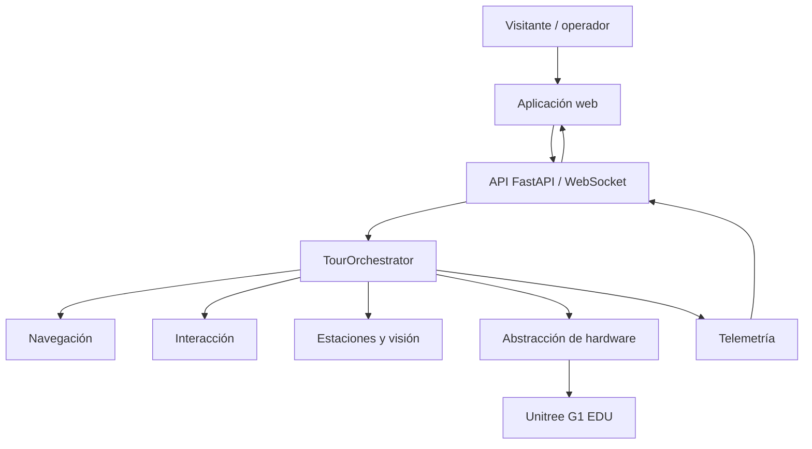

# OttoGuide

## Robot guía universitario sobre Unitree G1 EDU

OttoGuide es un producto académico diseñado para enriquecer las visitas universitarias en UADE. Integra un robot humanoide, una aplicación web y servicios de software para transformar un recorrido en una experiencia guiada, estructurada e interactiva.

El robot funciona como guía o co-guía: acompaña la visita, presenta contenidos en paradas definidas y suma una capa de interacción para visitantes y operadores. El alcance original es un MVP/piloto acotado para UADE Monserrat —Lima 3/Lima 2— con cinco paradas de diálogo predefinidas.

## El proyecto

Una visita universitaria necesita orientación y contexto; OttoGuide propone además una experiencia diferenciadora y memorable. El sistema organiza el recorrido, el contenido y las transiciones de interacción para que el robot sea un medio integrado de comunicación, no un fin aislado.

El MVP plantea interacción local durante el recorrido estructurado y conversación libre al finalizarlo. Su alcance se concentra en la experiencia de visita definida para UADE, sin extenderse a otros campus, integraciones institucionales, soporte multilingüe ni conversación abierta ilimitada durante la ruta.

## Qué hace OttoGuide

El flujo de alto nivel conecta a la persona que visita u opera el sistema con los servicios que coordinan el recorrido:

`visitante u operador → aplicación web o API → orquestación del tour → navegación, interacción y estaciones → hardware y telemetría`

- La aplicación web y la API ofrecen la superficie de operación y observabilidad.
- `TourOrchestrator` coordina el ciclo del tour, sus estados y las transiciones de interacción.
- La navegación se consume mediante un puerto y un backend elegido explícitamente por configuración.
- El subsistema de interacción, las estaciones y la visión aportan capacidades al recorrido.
- La abstracción de hardware vincula la lógica de OttoGuide con la integración Unitree G1 EDU.

## Arquitectura



La arquitectura separa los límites de interfaz de los backends concretos: navegación, interacción y hardware se configuran de forma explícita para cada entorno. La integración con Unitree queda encapsulada detrás de la interfaz de hardware del proyecto.

## Componentes principales

| Componente | Ubicación actual | Función en lenguaje simple |
|---|---|---|
| Entrada del backend | [`main.py`](<codigo ottoguide/main.py>) | Crea la aplicación FastAPI, integra el router y gestiona el ciclo de vida del sistema. |
| Orquestación | [`src/core/`](<codigo ottoguide/src/core/>) | Coordina el tour, sus estados, eventos y transiciones de interacción. |
| Navegación | [`src/navigation/`](<codigo ottoguide/src/navigation/>) | Define el puerto de navegación, sus modelos y los bridges elegidos por configuración. |
| Interacción | [`src/interaction/`](<codigo ottoguide/src/interaction/>) | Reúne el contrato de runtime, conversación, audio y los workers de interacción, incluido el backend físico C++ del pipeline de audio. |
| Estaciones y visión | [`src/stations/`](<codigo ottoguide/src/stations/>) y [`src/vision/`](<codigo ottoguide/src/vision/>) | Modelan paradas del recorrido y disparadores visuales/QR. |
| Abstracción de hardware | [`hardware/`](<codigo ottoguide/hardware/>) | Aísla la lógica de OttoGuide de la integración Unitree y ofrece adaptadores para los entornos de ejecución y desarrollo soportados. |
| API y telemetría | [`api/`](<codigo ottoguide/api/>) | Expone operaciones del tour, consultas de información y telemetría por WebSocket. |
| Aplicación web | [`ottoguide_web_app/frontend/`](<ottoguide_web_app/frontend/>) | Panel React/Vite para visualización y operación desde navegador. |

## Stack tecnológico

| Área | Tecnologías presentes |
|---|---|
| Backend | Python 3.10+, FastAPI, Uvicorn y Pydantic Settings |
| Robótica e integración | CycloneDDS, Unitree SDK2, interfaz de hardware y puertos de navegación |
| Interacción local | Ollama, faster-whisper, Piper TTS y componentes de audio |
| Visión | OpenCV, NumPy y detección QR asociada a estaciones |
| Frontend | React, Vite, Recharts y Lucide |
| Empaquetado | Docker Compose para backend, Ollama, Whisper y Piper |
| Calidad | Pytest/Pytest-Asyncio y `node --test` en el frontend |

## Estructura del repositorio

```text
.
├── AGENTS.md
├── README.md
├── TODO.md
├── codigo ottoguide/
│   ├── main.py             # entrada FastAPI/Uvicorn
│   ├── api/                # router y esquemas HTTP
│   ├── hardware/           # interfaz y adaptadores
│   ├── src/                # núcleo, navegación, interacción, estaciones y visión
│   ├── config/             # configuración de runtime, DDS y navegación
│   ├── data/               # guion y recursos del MVP
│   ├── scripts/            # automatizaciones locales y operativas
│   ├── tools/              # utilidades offline/HIL
│   ├── deploy/             # unidades de servicio
│   └── tests/              # pruebas y fixtures
├── ottoguide_web_app/
│   └── frontend/           # interfaz React/Vite
└── docs/
    ├── Arquitectura/       # contratos, decisiones y cierre técnico
    ├── Operaciones_HIL/    # protocolos, runbooks y material operativo
    ├── Hardware_Reference/ # referencias de la plataforma G1 EDU
    ├── Auditorias/         # auditorías y documentación de soporte
    ├── Investigacion/      # investigación y prototipos
    └── Historico/          # material archivado y provenance
```

## Puesta en marcha y ejecución

### Backend OttoGuide

El backend se encuentra en [`codigo ottoguide/`](<codigo ottoguide/>), tiene como entrada principal [`main.py`](<codigo ottoguide/main.py>) y requiere Python 3.10 o superior. Para un checkout de ingeniería nuevo, cree el entorno virtual e instale el proyecto antes de configurarlo. `.env.example` es la plantilla de configuración: revise sus valores antes del arranque según el entorno de ejecución.

```bash
cd "codigo ottoguide"

python3 -m venv .venv
source .venv/bin/activate

python -m pip install --upgrade pip
python -m pip install -e .

cp .env.example .env
# ajustar .env al entorno de ejecución

python main.py
```

Las opciones de configuración están centralizadas en [`config/settings.py`](<codigo ottoguide/config/settings.py>). La API expone, entre otras superficies, consulta de sistema en `/status` y telemetría por `/ws/telemetry`; las operaciones disponibles están definidas en [`api/router.py`](<codigo ottoguide/api/router.py>).

### Interfaz web

La UI canónica está en React/Vite y cuenta con [variables de entorno de ejemplo](<ottoguide_web_app/frontend/.env.example>). Para iniciarla localmente:

```bash
cd ottoguide_web_app/frontend
npm ci
npm run dev
```

Revise la [configuración del frontend](<ottoguide_web_app/frontend/src/config.js>) antes de conectarlo al backend: la URL de servicio y el perfil de despliegue se configuran de forma explícita.

### Stack integrado

El [archivo `docker-compose.yml`](<codigo ottoguide/docker-compose.yml>) define un stack integrado con backend OttoGuide, Ollama, Whisper y Piper. Su uso depende de las variables de entorno y de la topología de red, por lo que debe revisarse como parte de la configuración del entorno.

### Operación sobre Unitree G1 EDU

La integración física se configura mediante el backend real de hardware y la configuración del proyecto. Para entornos que utilizan la integración Unitree, el manifest de Python define el extra opcional `hardware`:

```bash
python -m pip install -e ".[hardware]"
```

La configuración y operación sobre la plataforma Unitree siguen los procedimientos de [`docs/Operaciones_HIL/`](docs/Operaciones_HIL/), el [protocolo HIL](docs/Operaciones_HIL/HIL_TESTING_PROTOCOL.md) y [AGENTS.md](AGENTS.md).

### Desarrollo y pruebas locales

El repositorio conserva adaptadores de mock/simulación y herramientas offline para desarrollo, pruebas y reproducibilidad. Como recurso de ingeniería, el [runbook de demo local](docs/Operaciones_HIL/RUNBOOK_DEMO_LOCAL.md) describe un pipeline de interacción local separado de la operación sobre hardware.

## Dónde está cada cosa

| Busco | Ruta |
|---|---|
| Entrada backend | [`codigo ottoguide/main.py`](<codigo ottoguide/main.py>) |
| API, esquema y telemetría | [`codigo ottoguide/api/`](<codigo ottoguide/api/>) |
| Orquestación y máquina de estados | [`codigo ottoguide/src/core/`](<codigo ottoguide/src/core/>) |
| Navegación | [`codigo ottoguide/src/navigation/`](<codigo ottoguide/src/navigation/>) |
| Interacción e IA | [`codigo ottoguide/src/interaction/`](<codigo ottoguide/src/interaction/>) |
| Abstracción de hardware | [`codigo ottoguide/hardware/`](<codigo ottoguide/hardware/>) |
| Visión y QR | [`codigo ottoguide/src/vision/`](<codigo ottoguide/src/vision/>) |
| Estaciones | [`codigo ottoguide/src/stations/`](<codigo ottoguide/src/stations/>) |
| Frontend | [`ottoguide_web_app/frontend/`](<ottoguide_web_app/frontend/>) |
| Configuración y perfiles | [`codigo ottoguide/config/`](<codigo ottoguide/config/>) y [`.env.example`](<codigo ottoguide/.env.example>) |
| Pruebas | [`codigo ottoguide/tests/`](<codigo ottoguide/tests/>) y [`ottoguide_web_app/frontend/test/`](<ottoguide_web_app/frontend/test/>) |
| Despliegue | [`codigo ottoguide/deploy/`](<codigo ottoguide/deploy/>) y [`docker-compose.yml`](<codigo ottoguide/docker-compose.yml>) |
| Arquitectura | [`docs/Arquitectura/`](docs/Arquitectura/) |
| Runbooks y HIL | [`docs/Operaciones_HIL/`](docs/Operaciones_HIL/) |
| Referencias de hardware | [`docs/Hardware_Reference/`](docs/Hardware_Reference/) |
| Auditorías | [`docs/Auditorias/`](docs/Auditorias/) y [`docs/audits/`](docs/audits/) |
| Provenance histórica | [`docs/Historico/`](docs/Historico/) y [`docs/legacy/`](docs/legacy/) |

## Documentación principal

- [Índice documental](docs/README.md)
- [Política operativa y de seguridad](AGENTS.md)
- [Límites y continuidad futura](TODO.md)
- [Memoria arquitectónica del MVP](docs/Arquitectura/MEMORIA_ARQUITECTONICA_MVP.md)
- [Contrato de cierre y publicación](docs/Arquitectura/CIERRE_FINAL_MVP.md)
- [Handoff y provenance de ramas](docs/Arquitectura/UNIFICACION_RAMAS_Y_HANDOFF.md)
- [Protocolo de pruebas HIL](docs/Operaciones_HIL/HIL_TESTING_PROTOCOL.md)
- [Manual de referencia Unitree G1 EDU](docs/Hardware_Reference/G1-MANUAL-DE-USUARIO-ESP.pdf)

## Seguridad

La operación física de la plataforma Unitree sigue los procedimientos operativos del proyecto y [AGENTS.md](AGENTS.md). Los entornos de desarrollo y offline se gestionan por separado de la operación sobre hardware.

## Sobre esta entrega

Esta es la entrega académica final, canónica y autocontenida de OttoGuide. La política de operación y Git está en [AGENTS.md](AGENTS.md), y la documentación técnica y operativa amplía los detalles del proyecto.
